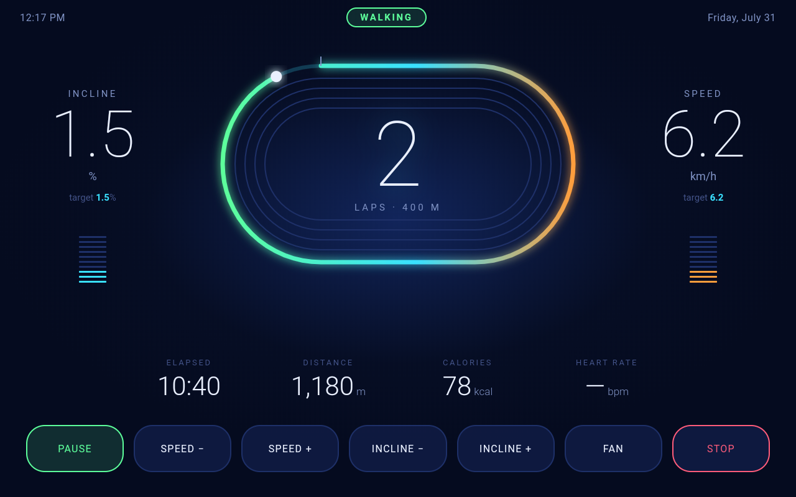

# STRIDE

**A NordicTrack treadmill, free of its subscription, talking to Home Assistant.**

> # 🚧 WORK IN PROGRESS — not ready for public use
>
> **Please do not follow these instructions on your own treadmill yet.**
>
> This is published early so it can be read, not so it can be run. It works —
> it is in daily use — but on exactly one machine, set up by the person who
> wrote it. The install guides are unfinished and the failure modes on other
> hardware are unknown.
>
> **Nothing here is supported.** Use it at your own risk. That said, the change
> is reversible: a factory reset restores the treadmill's original software,
> which has been verified on the machine this was built against.
>
> By all means read the code, take the [protocol notes](protocol/FITPRO_PROTOCOL.md),
> or tell me what board your treadmill has. Just don't point it at a machine
> you care about until this banner comes down.

> ⚠️ **This software drives a motorised treadmill.** Read [SAFETY.md](SAFETY.md)
> before installing anything. The physical safety key remains the stop of
> record; incline is driven, speed is only ever suggested.

> ⛔ **Never accept the Gen 7 / iFit 2.0 update on your console.** It is
> understood to close the privileged-mode route everything here depends on,
> permanently and with no way back. Modify first, update never. If your machine
> is already on Gen 7, none of this will work.

STRIDE replaces the software on a treadmill console with something you own. The
belt and deck work without a login, without a subscription, and without an
internet connection — and everything the machine knows appears in Home
Assistant as ordinary entities.

**Status: v0.5.** Working and in daily use on one treadmill. What v1.0 needs is
not more features — it is install guides with photographs, HACS packaging for
the Home Assistant side, a rebuilt dashboard, and the companion app on the App
Store. The software is further along than the version number suggests;
everything around it is not.



**[More screenshots →](docs/GALLERY.md)**

---

## What it is, in three parts

| | |
|---|---|
| **`console/`** | An Android app for the treadmill's own screen. Talks to the motor board over USB, drives incline, runs guided walks, and offers five completely different interfaces. |
| **`homeassistant/`** | Scripts that install the coach, the reminders and a health dashboard. **Optional** — the treadmill registers itself in Home Assistant without any of it. |
| **`ios/`** | A companion app that syncs Apple Health into your own Home Assistant. No account, no third-party server, no subscription. |

Plus [`protocol/`](protocol/FITPRO_PROTOCOL.md) — the FitPro serial protocol,
decoded and written down. If you only take one thing from this repository, take
that.

---

## The part that surprises people

**Home Assistant needs nothing installed to see the treadmill.**

The console publishes its own MQTT discovery. Put your broker details into
Settings → Home Assistant on the treadmill, and a *STRIDE Treadmill* device
appears in Home Assistant with speed, incline, distance, elapsed time, pulse,
calories, mode and workout — plus a separate device per person as they walk.

No integration to install, no YAML, no custom component. **Build whatever
dashboard you like from those entities** — there is no STRIDE dashboard you
have to accept, and a shipped one will come through HACS later rather than
being a prerequisite now.

The `homeassistant/` scripts are for the extras: the coach, the reminders, and
an opinionated health dashboard if you want a starting point.

---

## Does this work on my treadmill?

**Proven on:** one NordicTrack with a FitPro-based motor board, reporting
device id `0x04`, incline −3 to +12 %, speed 1.6 to 20 km/h.

**Probably works on:** other NordicTrack and ProForm consoles using the same
FitPro board. The protocol is a family, not a model.

**Nobody knows yet**, honestly. If you have a different machine,
[`console/usbprobe`](console/usbprobe) will tell you what your board answers to
— please open an issue with what you find, whether it works or not. That is the
single most useful contribution right now.

You will also need the console to be an Android device you can reach with
`adb`. That is the part that varies most between models and years.

---

## Installing

**[docs/INSTALL.md](docs/INSTALL.md)** — but read the banner above first. That
guide has not yet been followed by anyone who did not already know the answers,
and it says so at the top and marks the places it is weakest.

In outline:

1. **Check your board** with [`console/usbprobe`](console/usbprobe), which
   reads and changes nothing — and please report what it says.
2. **Get into the console's privilege mode** — a tap sequence and a
   challenge-response code — and enable ADB.
3. **Run [`tools/unchain.sh`](tools/unchain.sh)** — disables the iFit software,
   `com.ifit.eru` first, because that is what re-locks the console on every
   boot.
4. **Build and install the console app**, then set it up on its own screen.
5. **Optional:** broker details on the console and the treadmill appears in
   Home Assistant. Then the coach, and the iOS app for Apple Health.

Stop after step 4 and you have a treadmill with no subscription, which is most
of the point. Steps 1–5 need nothing installed on the Home Assistant side.

---

## Configuration

Nothing personal is baked in anywhere. Two places hold settings, and neither is
a source file.

**The console configures itself, on itself.** Broker details, who walks, units,
warm-up, the coach, heart-rate source, display — all in Settings on the
treadmill's own screen. No config files, no rebuild.

**The Home Assistant side reads one file:**

```sh
cp homeassistant/stride.conf.example homeassistant/stride.conf
```

Every key is documented in that example, including what happens when you leave
it blank — which is always "that subject is absent", never an error. No scale,
no blood-pressure cuff, no phone: the coach is built to say nothing about what
it was not given rather than to hedge or guess.

One key has no default and cannot have one: `coach_ai_task`, because which AI
entity you have depends entirely on which integration you set up.

**If you want weekly and monthly totals**, copy
[`homeassistant/packages/stride.yaml`](homeassistant/packages/stride.yaml) into
your Home Assistant config. The console publishes a per-session counter that
resets at the start of every walk — correct for a session, useless for "how far
this week" — so the accumulation has to happen in Home Assistant. That file
also creates the helpers the coach and reminders expect to find.

---

## Design decisions worth knowing

- **Kotlin owns the treadmill, HTML owns the screen.** The five interfaces are
  HTML in a WebView, so they can be designed in a browser. The buttons do what
  buttons do — tap SPEED+ and the belt speeds up — but every request goes
  through Kotlin, which clamps it to what the board says it can do. A bad
  layout can't outrun the machine.
- **The coach decides when to speak; Home Assistant decides what it says.**
  With HA unreachable it still marks your kilometres from a set of built-in
  lines.
- **A stale number is worse than a missing one.** Every health metric carries
  its age, and anything that hasn't changed since midnight is withheld rather
  than shown as today's. Learned the hard way, from a coach cheerfully
  reporting yesterday's step count at 7am.
- **Coaching and recording are per person**, not per console. A guest gets
  neither.

---

## Licence

[Apache-2.0](LICENSE). No warranty of any kind — see [SAFETY.md](SAFETY.md),
which you should read anyway.

STRIDE is an independent project, produced for compatibility with hardware its
authors own. It is not affiliated with, endorsed by, or supported by iFIT
Health & Fitness, ICON Health & Fitness, NordicTrack, ProForm, Apple or Home
Assistant. All trademarks are the property of their respective owners and are
used only to identify what this works with.

This repository contains no code from any of those companies. The protocol
notes are an independent interoperability specification — a description of a
wire format, not a copy of anyone's documentation.
