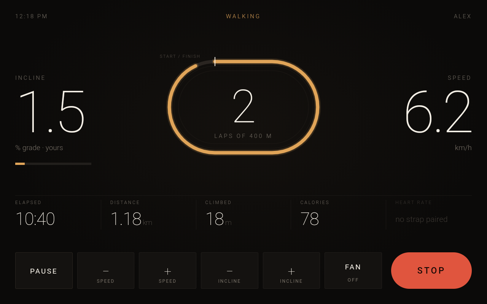
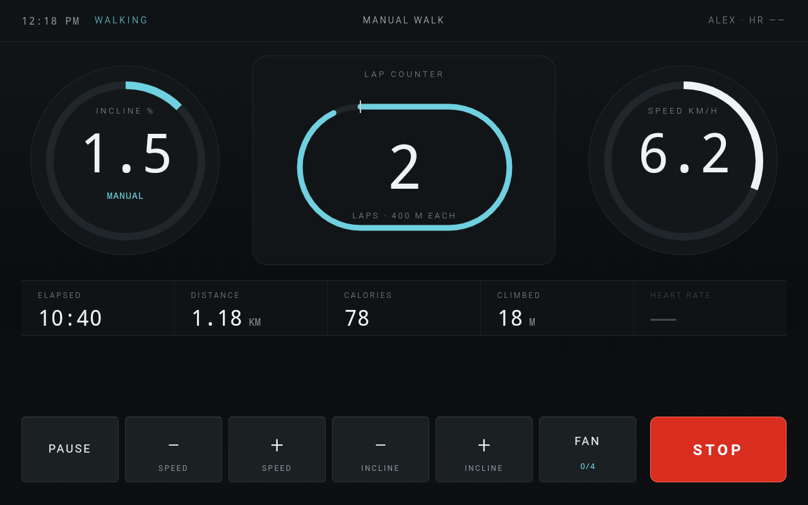
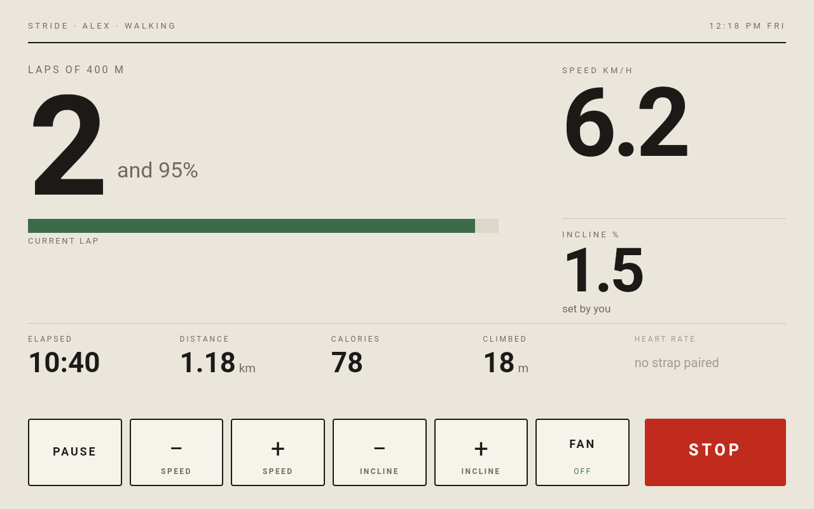
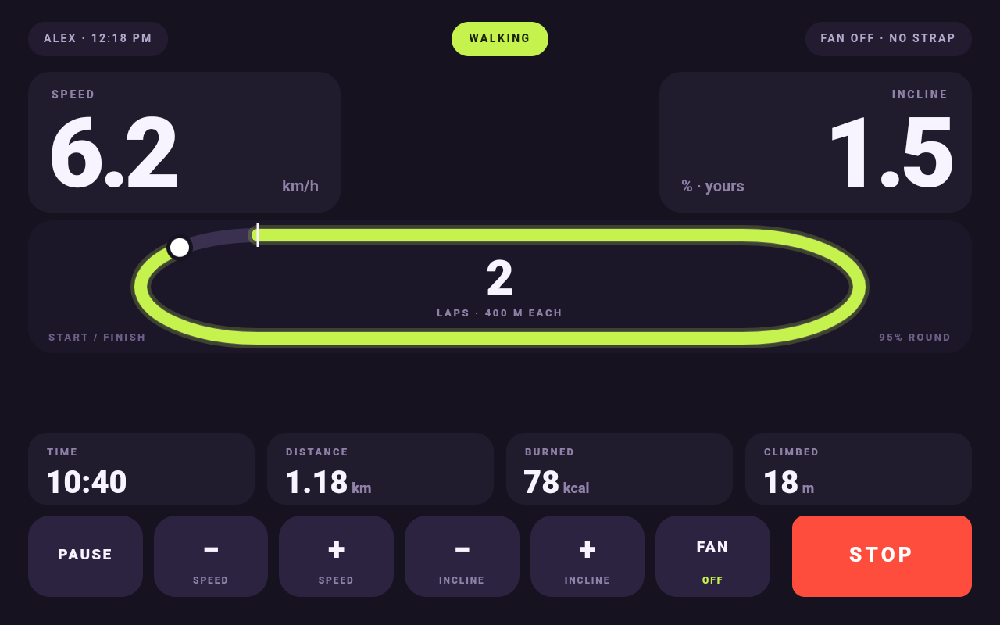
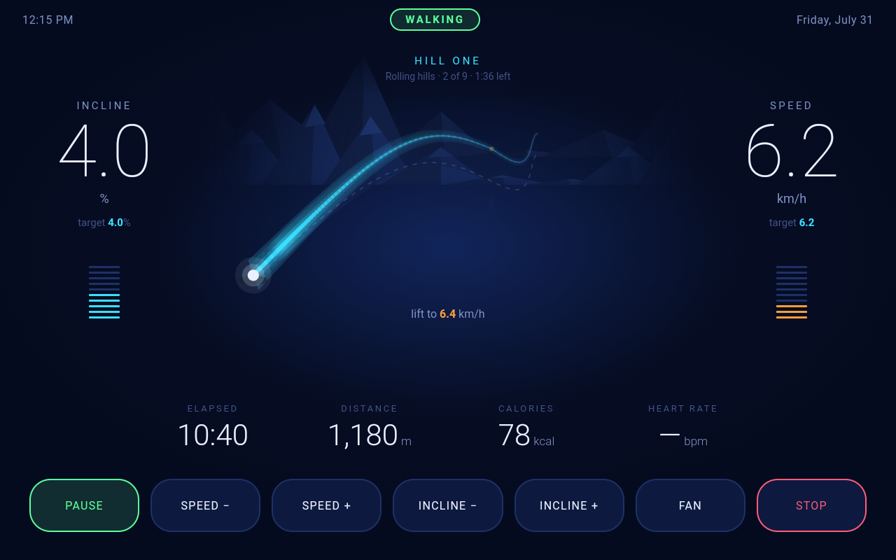
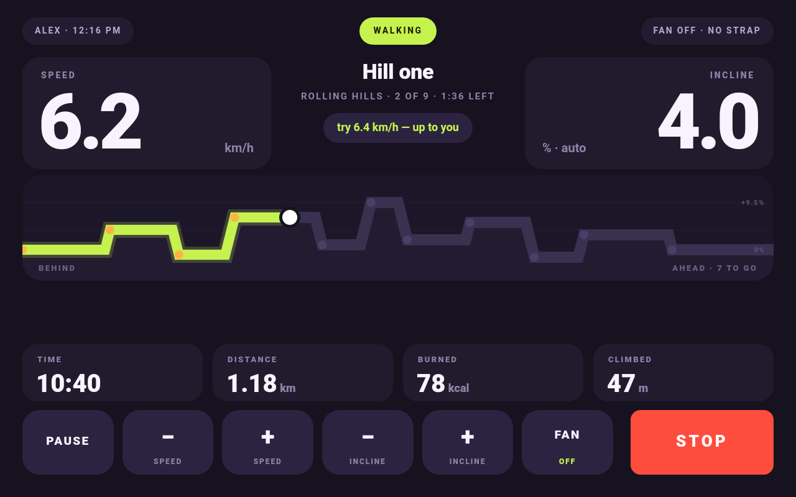
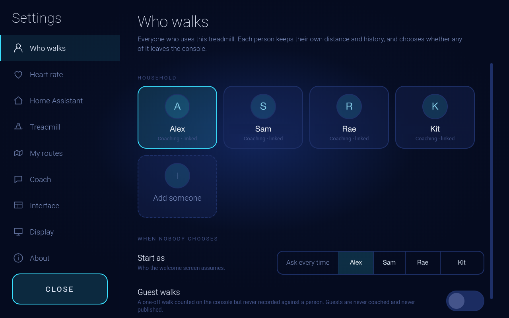
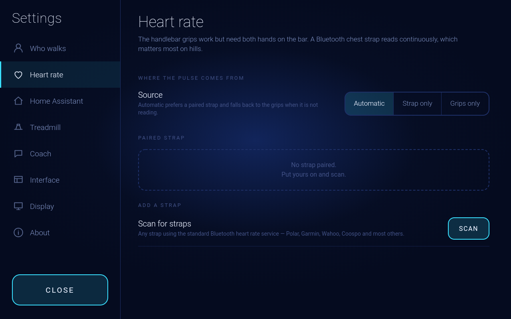
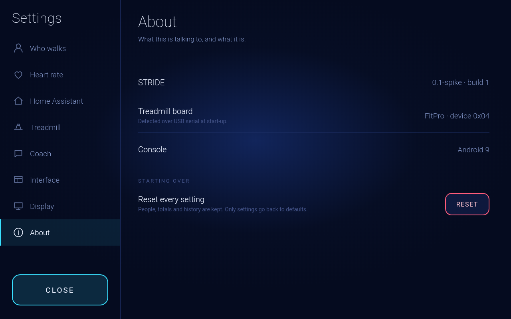

# Screenshots

1280×800, straight off the console. Mocked-up numbers, made-up names.

## The five interfaces

Each one is a separate document with its own layout — not a theme. The
treadmill behaves the same in all of them.

### Original
A 400 m oval, lap count in the middle.

### Ember
Near-black and amber. Built for 6am.

### Cluster
Dials and mono figures. An instrument panel.

### Daylight
The light one, for a bright room.

### Pacer
Chunky pills, hard to misread mid-stride.

## A guided walk

The oval is replaced by the ground ahead — the profile, where you are on it,
and the next segment. STRIDE moves the incline; "lift to 6.4 km/h" is only a
suggestion and the belt doesn't act on it.

Same walk in Pacer, drawn as a lane:

## Settings

On the treadmill's own screen. No config files, no rebuild.

### Who walks
Everyone gets their own totals. Coaching and recording are per person, and can
be linked to a Home Assistant `person`.

### Heart rate
Bluetooth chest straps, using the standard heart rate service — the scan
filters on service UUID, not brand, so most straps work.

### About
The board line is read over USB at startup.

## Welcome

Nobody is set up out of the box, so it offers a guest walk until you add
people.

