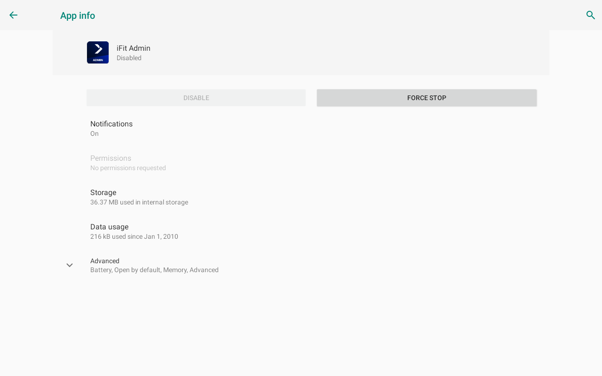
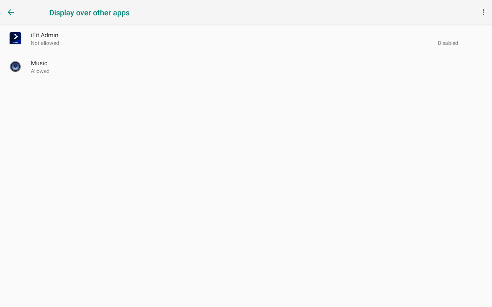
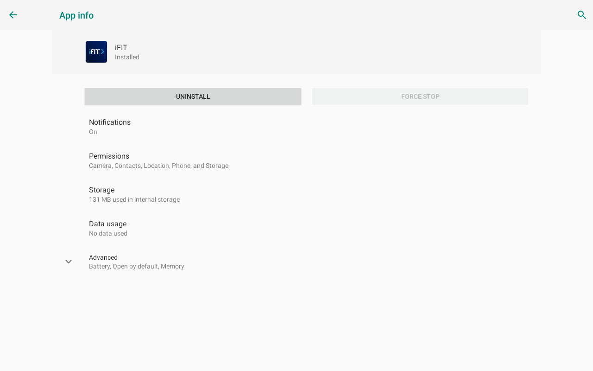
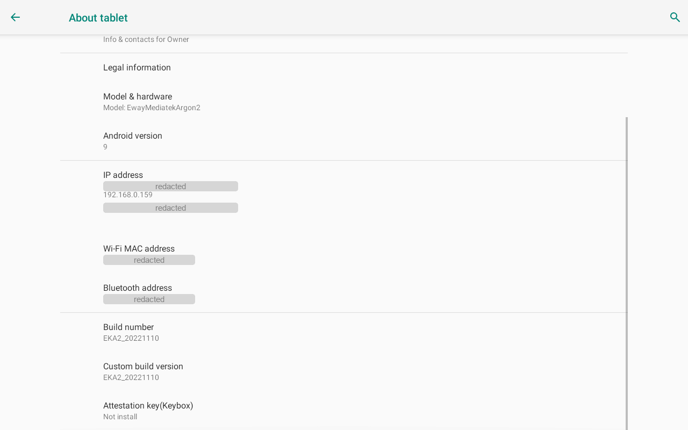
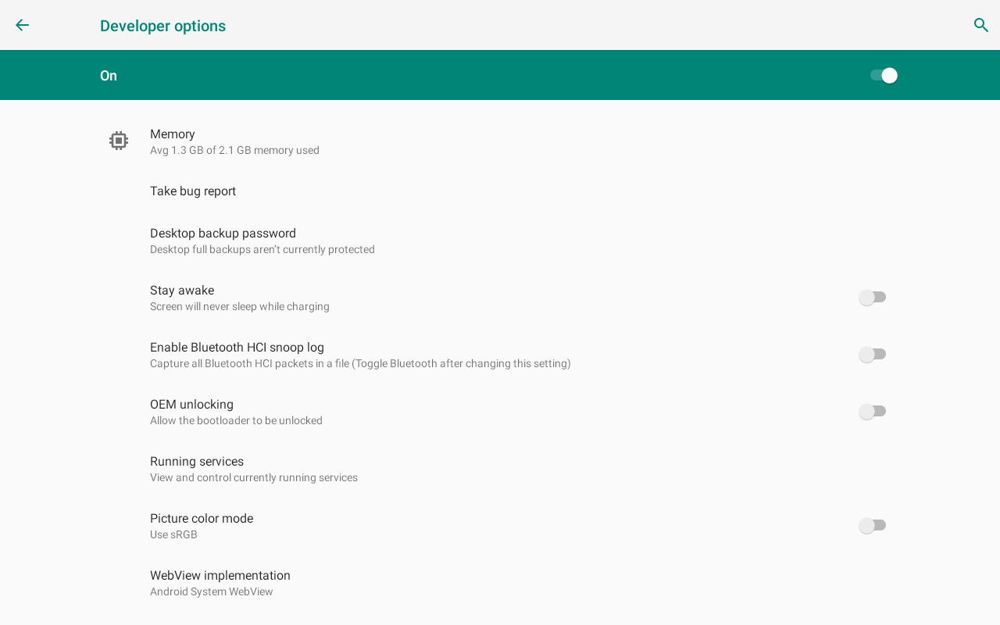
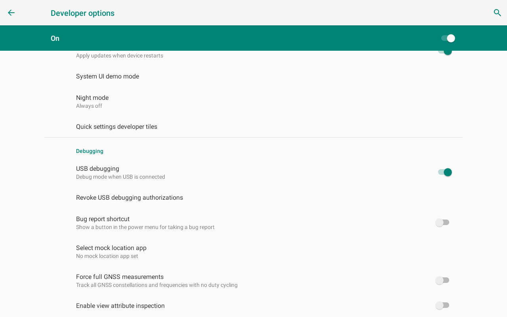
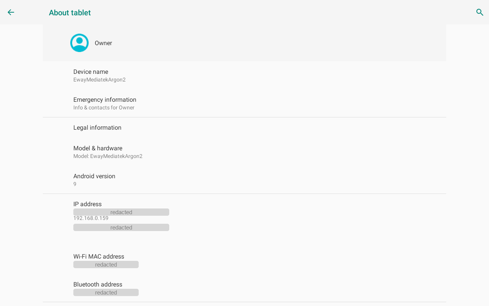

# Installing STRIDE

> 🚧 **DRAFT.** Nobody has followed this page end to end on a factory-reset
> machine. [Report anything that does not match](https://github.com/keranm/strideApp/issues).

**Read [SAFETY.md](../SAFETY.md) before you start.** This software drives a
motorised treadmill.

> **Gen 7 / iFit 2.0.** Second-hand reports say this update closes the
> privileged-mode route used below. Nobody here has seen it happen, and it is
> one passing comment on another site rather than anything tested. Declining
> the update costs nothing, so decline it until somebody knows either way.

To undo everything: factory reset the console.

---

## What you need

| | |
|---|---|
| A treadmill | NordicTrack or ProForm, FitPro motor board, Android console. Check [Step 0](#step-0-check-your-treadmill). |
| A computer | macOS or Linux, with `adb` and Python 3.9+. |
| Home Assistant | Optional. Needs an MQTT broker. |
| An iPhone | Optional. Apple Health only. |

Allow about an hour for Part 1, ten minutes for Part 2.

Parts 2 and 3 are optional. Stop after Part 1 and the treadmill works with no
subscription.

---

## Step 0. Check your treadmill

STRIDE is confirmed on one machine:

| | |
|---|---|
| Generation | Gen 6, the "CLASSIC" embedded console |
| GlassOS | 8.51.7.1070 |
| System version | EKA2_20221110 |
| Firmware | 84.121 |
| Motor board | FitPro, device id `0x04` |
| Ranges reported | incline -3 to +12 %, speed 1.6 to 20 km/h |

- **Likely to work:** other Gen 6 NordicTrack and ProForm consoles on a FitPro board.
- **Unknown:** Gen 7 / iFit 2.0. Reported not to work, untested here.
- **Required:** an Android console you can reach with `adb`.

What you can check right now, on the console's own screen:

1. Go to **Settings → About tablet**.
2. Read **Build number**. This machine reports `EKA2_20221110`.
3. Read **Android version**. This machine is on Android 9.

You cannot identify the motor board yet. That needs ADB and the iFit software
out of the way, so it happens in [step 1.6](#16-identify-the-motor-board).

[Open an issue](https://github.com/keranm/strideApp/issues) with what you find,
working or not.

---

## Part 1. The console

### 1.1 Factory reset

1. Find the pinhole reset button. Look for a single small hole on the side
   panel or the top of the console.
2. Hold the pinhole in while you switch the treadmill on at the power switch.
3. Wait for *System recovery* in blue text.
4. Let it finish. Takes five to ten minutes.
5. Do not join Wi-Fi yet. Stay offline until iFit is disabled in step 1.3.

### 1.2 Enable privileged mode

On the iFit welcome screen:

1. Tap a blank area of the screen ten times.
2. Wait seven seconds. Nothing appears during the pause.
3. Tap the same spot ten more times.
4. The console shows a challenge code. Get the matching response code, either
   by ringing NordicTrack support and asking for one, or from a third-party
   calculator such as <https://getresponsecode.com> (no connection to this
   project).
5. Enter the response code.

### 1.3 Stop iFit locking you out again

Do this before anything else. Skipping it undoes every later step at the next
reboot.

Open **Settings → Apps**. Deal with two apps.

**iFit Admin** (`com.ifit.eru`):

1. Tap **Force stop**.
2. Go to **Settings → Apps → Special access → Display over other apps**.
3. Set iFit Admin to **Not allowed**.
4. Go to **Settings → Apps → Special access → Modify system settings**.
5. Set iFit Admin to off.





iFit Admin is a system app and cannot be uninstalled. Force stop plus those two
permissions is as far as it goes.

**iFit** (`com.ifit.standalone`):

1. Tap **Force stop**.
2. Tap **Uninstall**.



### 1.4 Enable ADB over Wi-Fi

1. Go to **Settings → About tablet**.
2. Tap **Build number** seven times.

   

3. Go to **Settings → Developer options**.

   

4. Turn on **USB debugging**.

   

5. Pull down the notification panel, long-press **Wi-Fi**, and join your network.
6. Go to **Settings → About tablet** and read the **IP address**.

   

On your computer:

```sh
adb connect <console-ip>:5555
adb devices
```

✅ The console lists as `device`, not `unauthorized` or `offline`.

Do not turn USB debugging off afterwards.

### 1.5 Read unchain.sh before running it

[`tools/unchain.sh`](../tools/unchain.sh) does five things in order:

1. Disables `com.ifit.eru` and denies it `SYSTEM_ALERT_WINDOW` and `WRITE_SETTINGS`.
2. Disables the remaining iFit packages.
3. Turns on developer settings and keeps the screen awake.
4. Installs a launcher.
5. Installs STRIDE if you have built it, and sets it as the home app.

Run it with `STRIDE_KIOSK=0` to skip step 5. The script prints the command that
undoes the home-app change.

```sh
./tools/unchain.sh
```

> The console's USB port is the link to the motor board, so Wi-Fi ADB is
> usually your only way in. Whether it survives a power cycle varies by
> console. Test yours before relying on it. STRIDE itself needs no ADB to run.

### 1.6 Identify the motor board

`console/usbprobe` asks the board what it is. It reads and writes nothing.

```sh
cd console/usbprobe
./run.sh
```

Read the result on the console's screen.

✅ It names a board and a device id. This machine reports FitPro, device `0x04`,
incline -3 to +12 %, speed 1.6 to 20 km/h.

If it says the device is claimed, `com.ifit.eru` is running again. Re-run
`tools/unchain.sh`.

**[Open an issue](https://github.com/keranm/strideApp/issues) with what it
says,** working or not. A list of known-good boards is the most useful thing
this project could have and it does not exist yet.

### 1.7 Build and install

```sh
cd console/stride
./run.sh
```

`run.sh` builds, installs, launches, and tails the log. It finds the Android
SDK via `ANDROID_HOME` or `~/Library/Android/sdk`.

✅ The console shows the STRIDE welcome screen, and the log prints
`limits: <min>..<max> km/h, <min>..<max> %`.

### 1.8 Set up STRIDE

Everything is on the treadmill's own screen. There are no config files.

- **Settings → Who walks.** Add yourself. Nobody is pre-configured.
- **Settings → Treadmill.** Units, warm-up, cool-down, guided-walk speed limit.
- **Settings → Interface.** Pick one of five. *Original* is the most tested.

✅ Clip the safety key, choose a workout, and check the belt starts and the
distance climbs.

**Stop here if you do not use Home Assistant.**

---

## Part 2. Home Assistant

### 2.1 Connect the treadmill

Requires the [MQTT integration](https://www.home-assistant.io/integrations/mqtt/)
and a broker. Nothing from this repository is installed for this step.

1. On the console, go to **Settings → Home Assistant**.
2. Enter broker host, port, username, password.
3. Tap **Test**.

✅ A **Treadmill** device appears under Settings → Devices with speed, incline,
distance, elapsed, pulse, calories, mode and workout. A second device appears
per person the first time they walk.

Build whatever dashboard you like from those entities. There is no custom
component to install.

### 2.2 Optional: weekly and monthly totals

The console's distance counter resets every walk, so totals accumulate in Home
Assistant.

1. Copy [`homeassistant/packages/stride.yaml`](../homeassistant/packages/stride.yaml)
   into your config as `packages/stride.yaml`.
2. Add to `configuration.yaml`:

   ```yaml
   homeassistant:
     packages: !include_dir_named packages
   ```

3. Restart Home Assistant.

✅ `sensor.treadmill_distance_weekly` exists and is not `unavailable`.

If it is unavailable, your treadmill device is named something other than
`Treadmill`. Set `treadmill_prefix` in `stride.conf` and the `source:` lines in
the package to match.

> **Gap:** this file is valid YAML and mirrors a working configuration, but has
> not been installed on a clean Home Assistant.

### 2.3 Optional: the coach and reminders

```sh
cd homeassistant
cp stride.conf.example stride.conf
```

1. Open `stride.conf`. Every key is documented in the file. Leave a key blank to
   skip that subject.
2. Set `coach_ai_task`. Find your AI entity under Developer Tools → States,
   prefix `ai_task.`.
3. Run what you want:

   ```sh
   python3 stride_coach_llm.py      # coach, and the automations that fire it
   python3 stride_reminders.py      # weigh-in and blood-pressure reminders
   python3 stride_persons.py        # publishes your HA people to the console
   ```

✅ `script.stride_coach` exists. Run it with `kind: morning` and a `task`, and a
message appears on `sensor.stride_coach`.

After `stride_persons.py`, the console's **Settings → Who walks** lists your
Home Assistant people under *From Home Assistant*.

---

## Part 3. Apple Health (iPhone)

Optional. Nothing else depends on it.

Use **[AH for HA](https://github.com/keranm/ah-for-ha)**, which is a separate
project with its own guide. There is nothing in this repository to install for
it.

AH for HA also publishes outdoor walks as gradient profiles over MQTT, which
STRIDE replays on the deck.

> `homeassistant/stride_health_webhook.py` is frozen. Setting this up for the
> first time? You do not need it.

---

## If it goes wrong

1. Pull the safety key.
2. Switch the treadmill off at the wall.
3. To restore the manufacturer's software, factory reset from the console's own
   recovery.

---

## Credit

Steps 1.1 to 1.4 follow a community *NordicTrack Gen 6 modding guide*. That
guide heads towards QZ Companion. STRIDE goes a different way after 1.4.

If you know who wrote it, [tell us](https://github.com/keranm/strideApp/issues).

---

## Testing this guide

Most likely to be wrong:

- **Steps 1.1 to 1.4.** Written up after the fact. Nobody has followed this page
  on a freshly reset machine.
- **Step 2.2.** Never installed on a clean Home Assistant.
- **Every ✅ check.** If one does not happen, that is the bug.
- **Anything you had to work out that is not written down.**

Open an issue. "Stuck at 1.1 on a 2019 Commercial 1750" is useful.
